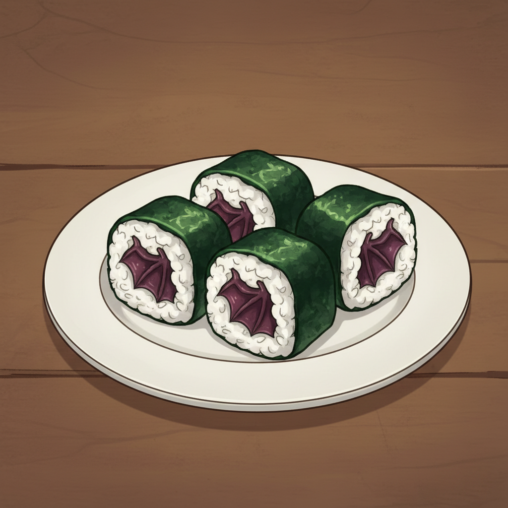
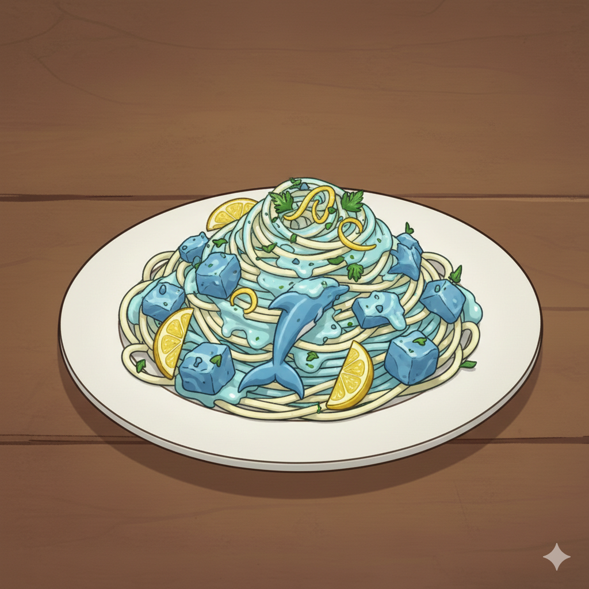
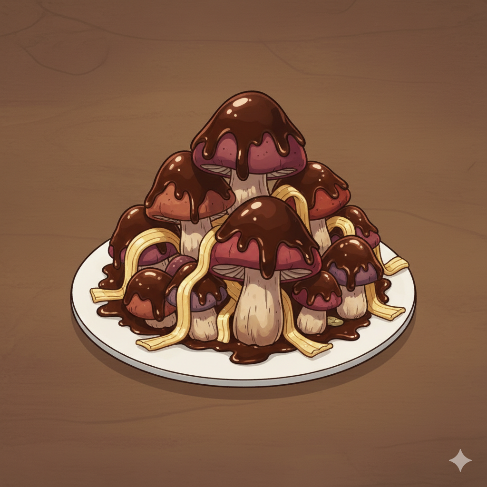
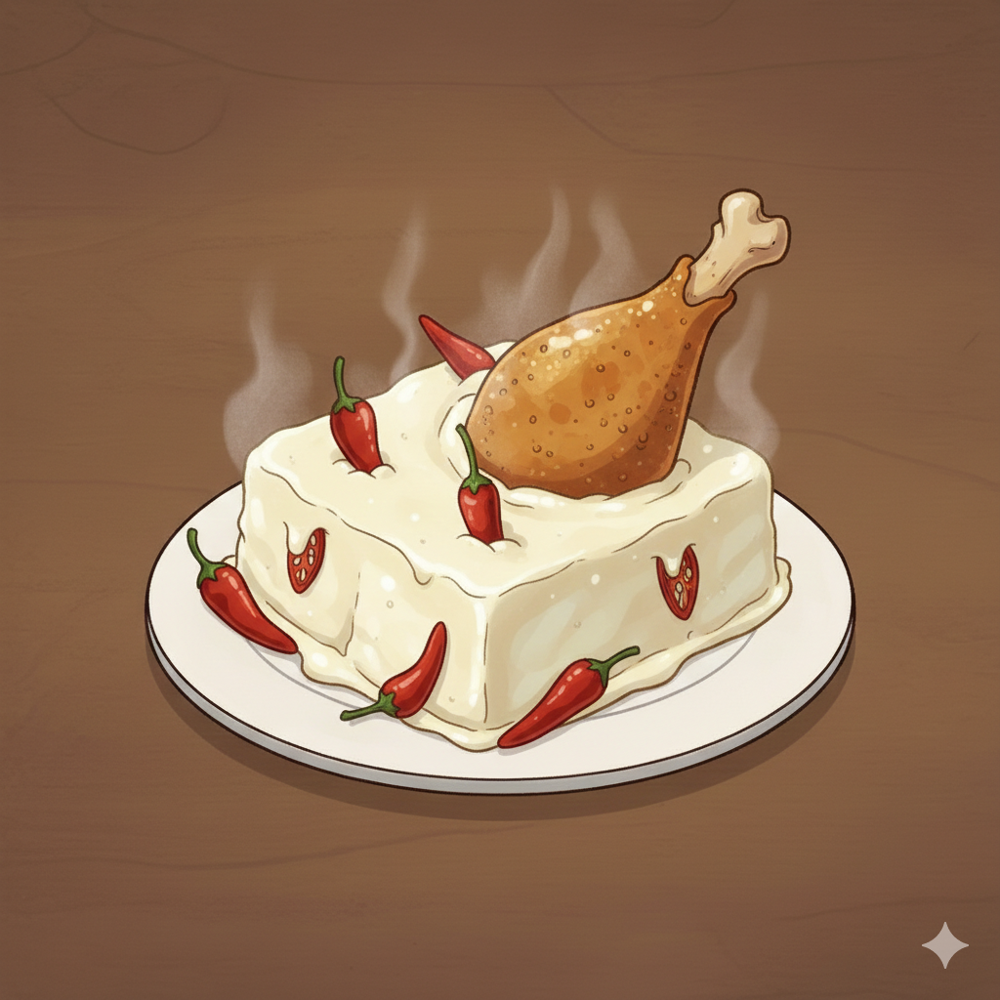
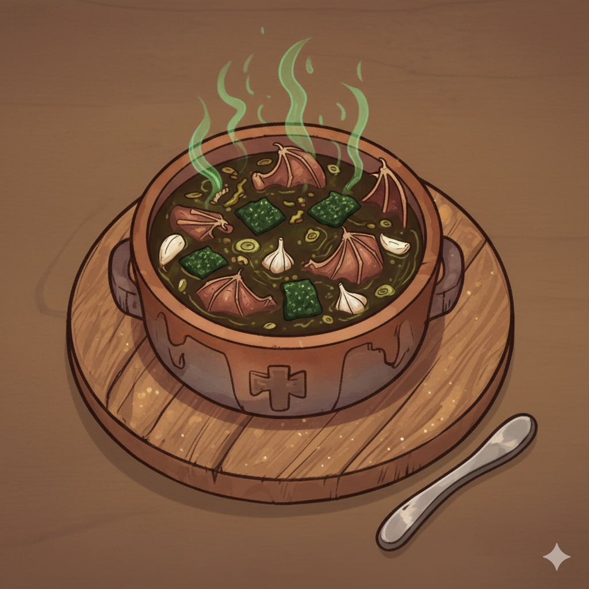
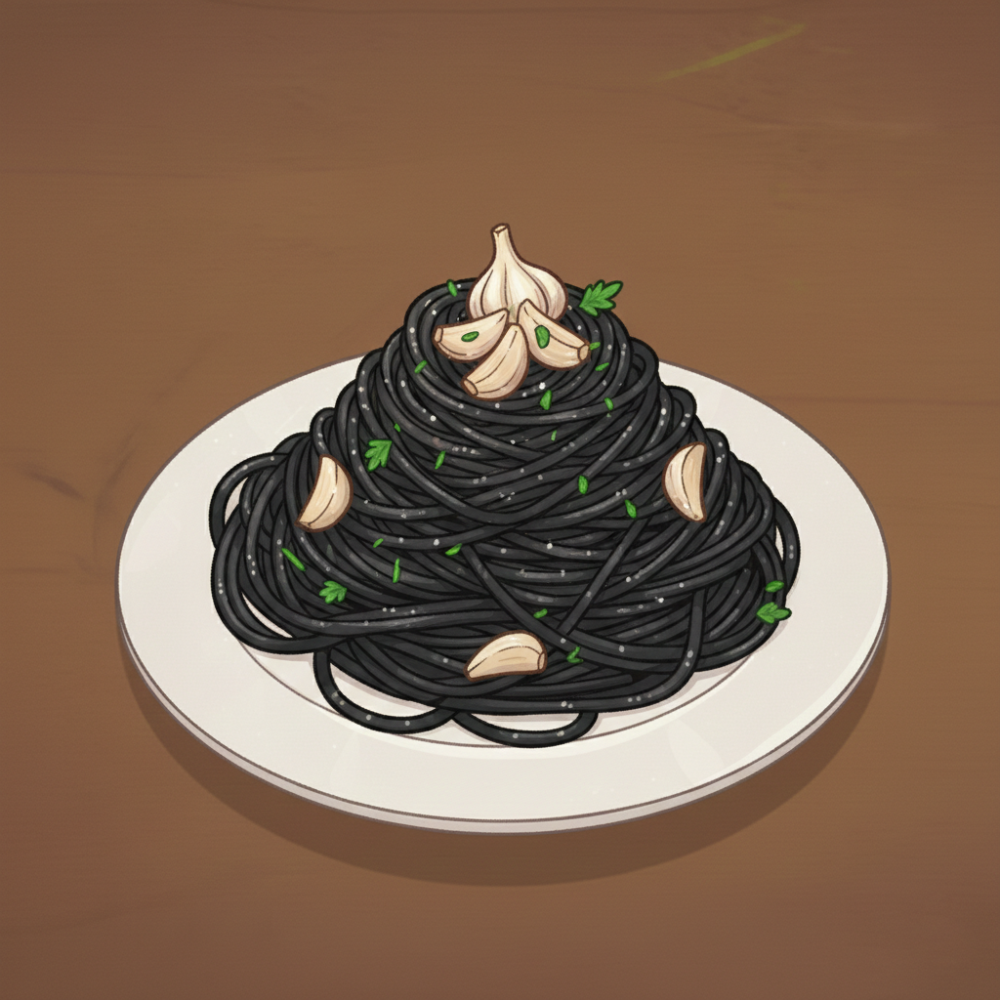
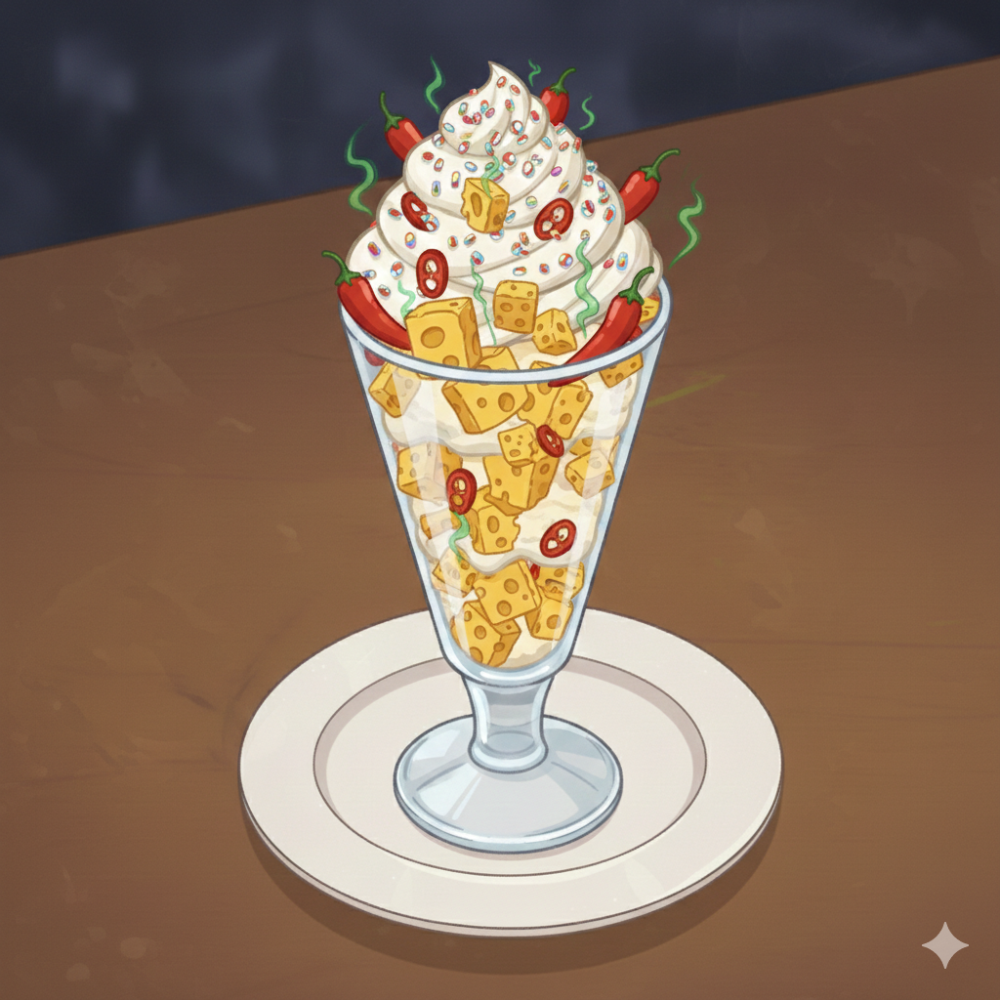

# 👨‍🍳 Nejlepší Kuchař

> *Osobní kulinářský génius, který vám doporučí jídla na základě vašich (pochybných) preferencí.*

**Nejlepší Kuchař** je interaktivní webová aplikace, kde si vybíráte své oblíbené ingredience a na základě toho vám kuchař doporučí bizarní pokrm z jeho tajné kuchařky. A pokud některou ingredienci nemá? Nebojte, vymluví se jako pravý profesionál!


---

## 🎮 Jak to funguje

1. **Odpověz na otázky** - Z náhodně vybraných dvojic ingrediencí vyber tu, která ti více chutná
2. **Vyber 3 ingredience** - Nebo klidně přeskoč, pokud ti nic nechutná
3. **Získej doporučení** - Kuchař ti najde nejvhodnější jídlo z jeho... zajímavé kolekce
4. **Užij si výmluvy** - Když něco chybí, kuchař má vždy po ruce kreativní vysvětlení

---

## 🍽️ Ukázka jídel

<table>
  <tr>
    <td align="center"><br><b>Sushidrink z Netopýra</b><br><i>Křupavá křídla v rýžovém objetí</i></td>
    <td align="center"><br><b>Uhelný dezert Popelka</b><br><i>Sladké jako polibek v dole Hlubina</i></td>
    <td align="center"><br><b>Delfíní sen na špagetách</b><br><i>Elegance mořských hlubin</i></td>
  </tr>
  <tr>
    <td align="center"><br><b>Hřibový šok v čokoládě</b><br><i>Les vs čokoládovna v temné uličce</i></td>
    <td align="center"><br><b>Kuřecí zmrzlina Pařát</b><br><i>Mražené osvěžení s pařátem</i></td>
    <td align="center"><br><b>Tvarůžkový donut s motýly</b><br><i>Vůně, co probudí i sousedy</i></td>
  </tr>
  <tr>
    <td align="center"><br><b>Netopýří guláš v řase</b><br><i>Upíři nemají šanci</i></td>
    <td align="center"><br><b>Uhelné špagety Ostravsko</b><br><i>Energie z hloubky 800 metrů</i></td>
    <td align="center"><br><b>Tvarůžková zmrzlina s chilli</b><br><i>Pálí a voní jako ponožky</i></td>
  </tr>
</table>

---

## 🛠️ Technologie

- **React 18** + **TypeScript** - moderní frontend
- **Vite** - rychlý build tool
- **Tailwind CSS v4** - utility-first styling
- **Framer Motion** - plynulé animace
- **CSV data** - snadná editace obsahu

---

## 🚀 Instalace a spuštění

```bash
# Klonování repozitáře
git clone https://github.com/0xMartin/Nejlepsi-Kuchar.git
cd Nejlepsi-Kuchar

# Instalace závislostí
npm install

# Spuštění vývojového serveru
npm run dev

# Build pro produkci
npm run build
```

---

## 📁 Struktura projektu

```
nejlepsi-kuchar/
├── public/
│   ├── data/
│   │   ├── ingredience.csv      # Seznam ingrediencí
│   │   ├── jidlo.csv            # Databáze jídel
│   │   ├── hlasky.csv           # Hlášky kuchaře
│   │   ├── hlasky-vymluvy.csv   # Výmluvy pro chybějící ingredience
│   │   ├── jidlo-img/           # Obrázky jídel
│   │   └── ingredience-img/     # Obrázky ingrediencí
│   └── kuchar.png               # Maskot aplikace
├── src/
│   ├── components/              # React komponenty
│   ├── types.ts                 # TypeScript typy
│   ├── utils.ts                 # Pomocné funkce
│   └── App.tsx                  # Hlavní komponenta
└── index.html
```

---

## 📝 Licence

MIT

---

*Vytvořeno s láskou a pochybným vkusem. Bon appétit! 🍴*
